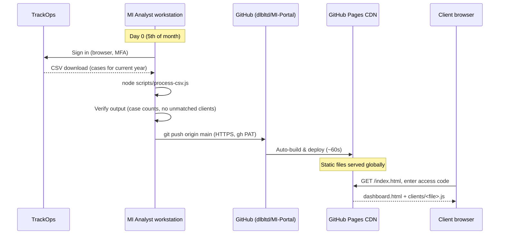
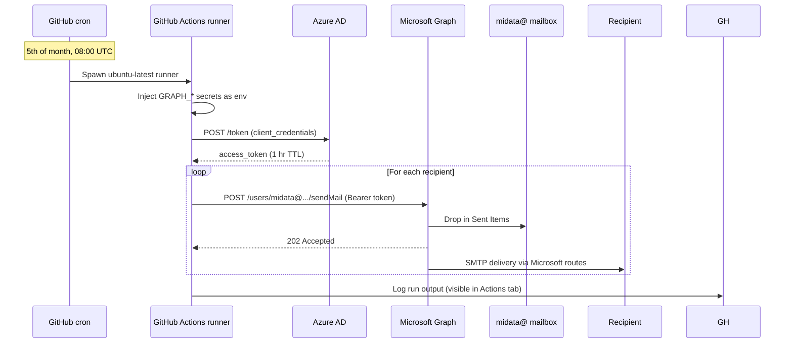

# AIarch001 — MI Portal Technical & Security Architecture

**Document reference:** AIarch001
**Version:** 1.0
**Issue date:** 11 May 2026
**Owner:** Managing Director, DLB Investigations Ltd
**Approved by:** Managing Director
**Next review date:** 11 May 2027
**Classification:** Internal — Restricted
**Related document:** AIrep001 (operational process — see `docs/AIrep001-MI-Process.md`)

---

## 1. Purpose

This document is the technical and security design record for the DLB MI Portal — the pipeline that produces and distributes monthly Management Information to insurer and legal clients. It complements **AIrep001** (which says *who does what and when*) by recording *what the system is, how it is wired, what trust boundaries exist, and what controls are in place*.

It is intended to:

- Provide a single auditable record of system design and security controls for **ISO/IEC 27001:2022** and **SOC 2** assessment
- Enable rapid handover to a new engineer or auditor
- Anchor incident response — if any component fails or is compromised, this document identifies blast radius and recovery path

This document is **not** part of the DLB ISO 9001 quality management system; that is AIrep001's remit. This document addresses the security/availability/confidentiality criteria that 9001 does not.

## 2. Scope

In scope:

- The `dlbltd/MI-Portal` GitHub repository
- The `https://mi.dlbinvestigations.co.uk/` deployment (custom domain CNAME'd to GitHub Pages at `dlbltd.github.io`)
- The GitHub Actions workflow `Monthly MI release email` and its scheduled execution
- The Azure AD app registration `DLB MI Mailer` and its association with the `midata@dlbinvestigations.co.uk` mailbox
- Local CSV processing on the MI Analyst's workstation
- Stored secrets used by automated processes

Out of scope:

- TrackOps (third-party SaaS — referenced as a dependency only)
- Microsoft 365 tenancy administration beyond the specific app registration above
- Client-side use of the MI Portal once delivered (clients' own browsers and networks)

## 3. System overview

```
                         ┌─────────────────────────┐
                         │  TrackOps (3rd party)   │  source of truth for cases
                         │  dlbinvestigations.     │
                         │     viewcases.com       │
                         └────────────┬────────────┘
                                      │  Manual CSV export by MI Analyst
                                      │  (Imperva WAF blocks automation)
                                      ▼
┌────────────────────────────────────────────────────────────────────┐
│  MI Analyst workstation                                            │
│  ─────────────────────────                                         │
│   ~/Downloads/cases_*.csv ──► node scripts/process-csv.js          │
│                              ─► writes clients/*.js                │
│                              ─► git commit + git push              │
└────────────────────────────┬───────────────────────────────────────┘
                             │ HTTPS + SSH/PAT
                             ▼
┌────────────────────────────────────────────────────────────────────┐
│  GitHub — dlbltd/MI-Portal                                         │
│  ─────────────────────────                                         │
│   • main branch (source of truth for code + generated data)        │
│   • GitHub Actions (scheduled workflow + workflow_dispatch)        │
│   • Secrets store (GRAPH_*, immutable to reads, encrypted at rest) │
│   • GitHub Pages (auto-deploy on push to main)                     │
└─────────────────┬───────────────────────────────┬──────────────────┘
                  │                               │
   monthly cron   │                               │ HTTPS GET
   05 of month    │                               │ (clients' browsers)
   08:00 UTC      │                               ▼
                  │                  ┌──────────────────────────┐
                  │                  │  GitHub Pages CDN        │
                  │                  │  https://dlbltd.github.  │
                  │                  │    io/MI-Portal/         │
                  │                  └──────────────────────────┘
                  ▼
┌────────────────────────────────────────────────────────────────────┐
│  GitHub Actions runner (ephemeral Ubuntu VM)                       │
│  ─────────────────────────                                         │
│   scripts/send-monthly-email.js                                    │
│   1. Read recipients from client-recipients.json                   │
│   2. OAuth2 client-credentials grant → Microsoft Graph             │
│   3. POST /users/midata@.../sendMail per recipient                 │
└────────────────────────────┬───────────────────────────────────────┘
                             │  HTTPS, mTLS to Microsoft
                             ▼
┌────────────────────────────────────────────────────────────────────┐
│  Microsoft 365 / Azure AD                                          │
│  ─────────────────────────                                         │
│   • App registration "DLB MI Mailer" (this tenant only)            │
│   • Mail.Send (Application) permission with admin consent          │
│   • Sends as midata@dlbinvestigations.co.uk                        │
└────────────────────────────┬───────────────────────────────────────┘
                             │
                             ▼
                  ┌──────────────────────────┐
                  │  Client recipients       │
                  │  (insurer / legal)       │
                  └──────────────────────────┘
```

## 4. Components inventory

| Component | Provider | Purpose | Criticality | Notes |
|---|---|---|---|---|
| TrackOps (case management) | Viewcases.com SaaS | Source of truth for case data | Critical | Fronted by Imperva WAF — API automation blocked at network layer; CSV export remains the integration channel |
| GitHub repository `dlbltd/MI-Portal` | GitHub Inc | Source code + generated data + workflows + audit history | Critical | Private repo; commits are signed by GitHub on push |
| GitHub Actions | GitHub Inc | Scheduled execution of the monthly mailer; manual `workflow_dispatch` for ad-hoc runs | High | Runner VM is ephemeral — destroyed after each run; secrets are injected via env vars and not persisted on disk |
| GitHub Pages | GitHub Inc | Static hosting of the MI Portal | High | Auto-deploys on push to main; HTTPS enforced; served over GitHub's CDN |
| Azure AD app registration `DLB MI Mailer` | Microsoft | OAuth2 client identity for Microsoft Graph | High | Tenant: `dlbinvestigations.co.uk`; Permission: `Mail.Send` (Application) with admin consent |
| Microsoft Graph API | Microsoft | Server-to-server mail send | High | Replaces SMTP AUTH which is tenant-blocked |
| Mailbox `midata@dlbinvestigations.co.uk` | Microsoft 365 | "From" identity on client emails; Sent Items audit | Medium | Standard M365 mailbox; no inbound automation; reply-to address |
| MI Analyst workstation | DLB-managed | Executes the monthly CSV processor + commits | Medium | macOS, Node 18+, gh CLI, git configured for HTTPS to GitHub |
| GitHub Secrets store | GitHub | Encrypted storage of automation credentials | Critical | Per-repository, scoped to Actions; values write-only via API once stored |

## 5. Data flow

### 5.1 Production flow (monthly, manual)



### 5.2 Email flow (monthly, automated)



## 6. Identity and access management

### 6.1 Human access

| Identity | What they can do | Authentication | Authorisation |
|---|---|---|---|
| Managing Director (process owner) | Admin everything | M365 SSO + MFA, GitHub MFA | Owner on both M365 tenant and GitHub `dlbltd` org |
| MI Analyst (primary) | Execute monthly release; edit `clients/`, `scripts/client-map.json`, `scripts/client-recipients.json` | M365 SSO + MFA; GitHub PAT (scope: `repo`, `workflow`) | GitHub repo write access; M365 Outlook for `midata@` |
| MI Analyst (backup) | Same as primary | Same | Same |
| Clients (read-only) | View their own MI dashboard | Static access code held in `index.html` `CLIENT_REGISTRY` | No login on M365 or GitHub — only the public Pages site |

### 6.2 Machine access (no human in the loop)

| Identity | What it can do | Authentication | Scope |
|---|---|---|---|
| Azure AD app `DLB MI Mailer` | Send mail as any mailbox in the tenant | OAuth2 client-credentials (client ID + client secret) | `Mail.Send` (Application). **Note:** this is a privileged scope; see §11 for hardening (Application Access Policy). |
| GitHub Actions workflow | Read repo contents; access encrypted Secrets | Workflow-scoped GITHUB_TOKEN; encrypted secrets injection | `permissions: contents: read` declared in workflow YAML |
| TrackOps API token `automi` (created, currently unused) | Would grant API access if WAF were not blocking | Bearer token | API tier permissions on TrackOps. Inactive in practice; token kept in TrackOps but not in GitHub Secrets. |

### 6.3 Access provisioning and deprovisioning

- Onboarding an MI Analyst: M365 admin invites to tenant + assigns `midata@` shared mailbox role; GitHub admin adds to `dlbltd` org with write access on `MI-Portal`.
- Offboarding: remove from M365 + GitHub same day; rotate `GRAPH_CLIENT_SECRET` if the leaving party held it; consider rotating client access codes if their tenure included access to `CLIENT_REGISTRY`.

## 7. Cryptography and secrets

| Secret | Purpose | Location | Rotation |
|---|---|---|---|
| `GRAPH_TENANT_ID` | Identifies the Azure AD tenant | GitHub Secrets (per-repo, encrypted) + workflow env vars | Effectively never (it's a tenant ID, not a credential) |
| `GRAPH_CLIENT_ID` | Identifies the app registration | GitHub Secrets + workflow env vars | Only on app re-creation |
| `GRAPH_CLIENT_SECRET` | Authorises the app to act on its own behalf | GitHub Secrets + workflow env vars; **never** in code or in plaintext on any workstation | **18 months max**, or 60 days before expiry, whichever is sooner. See AIrep001 Annex B for procedure. |
| `GRAPH_SENDER`, `GRAPH_FROM_NAME` | Operational config (not strictly secret) | GitHub Secrets for ease of redeploy | On mailbox change |

**Transport security:**

- All connections in the production and email flows are **HTTPS / TLS 1.2+**.
- GitHub Pages enforces HTTPS for the public dashboard.
- The Azure AD token endpoint and Microsoft Graph endpoints require TLS.
- TrackOps is HTTPS to the user and the Imperva edge.

**At-rest encryption:**

- GitHub Secrets: encrypted with libsodium sealed boxes (per GitHub's published implementation).
- GitHub repository on disk at GitHub: encrypted (GitHub managed).
- GitHub Pages static files: served from GitHub's CDN over HTTPS.
- M365 mailbox: encrypted by Microsoft (managed service).

**No secrets are stored in:**

- The repository contents (verified by `.gitignore` covering `node_modules/`, `.env*`).
- Any committed file (verify by `git grep -i "secret\|token\|password"` produces nothing).
- The MI Analyst's workstation persistently (the workstation reads from GitHub Secrets only inside the Actions runner, never on the workstation itself).

## 8. Data classification and handling

| Data | Classification | Where it lives | Notes |
|---|---|---|---|
| Case data (per-client) | **Confidential — client-restricted** | TrackOps (master); GitHub repo `clients/*.js` (derived); CDN (public URL but access-code gated) | Personal data (`Subject` field) is filtered out of the generated files — only `Case Number`, `Reference No.`, dates, fees and type are included. |
| Client access codes (e.g. `ZEGO26`) | **Confidential** | `index.html` `CLIENT_REGISTRY` — publicly fetchable; security is via code being known only to the client | Low-strength gate — see §11.4 for known limitation |
| Email recipient addresses | Internal | `scripts/client-recipients.json` (private repo) | Limited PII (names + work emails) |
| Generated SLA percentages | Confidential — client-restricted | Same as case data | Aggregates only |
| Source CSVs | Confidential | MI Analyst's workstation `~/Downloads/` | Retain 12 months per AIrep001; delete on retention expiry |

The MI Portal **does not contain claimant personal data**. Subject names, addresses and contact details remain in TrackOps and are explicitly excluded from `scripts/process-csv.js` output.

## 9. Logging and audit trail

| Event | Captured where | Retention |
|---|---|---|
| Code changes / data file regenerations | GitHub commit history | Indefinite |
| Manual workflow runs / scheduled runs / failures | GitHub Actions logs | 90 days (GitHub default) |
| Secret reads (when injected into a workflow) | GitHub Actions logs (masked values) | 90 days |
| Secret writes / rotations | GitHub Audit Log (org level if available; otherwise repo audit) | Per GitHub plan |
| Email sends | M365 Sent Items folder on `midata@` mailbox; Microsoft 365 audit log (if enabled at tenant level) | Per DLB retention policy |
| TrackOps case data changes | TrackOps internal audit | TrackOps managed |

**Sufficiency for audit:** any given monthly MI release can be reconstructed from (a) the source CSV (kept 12 months), (b) the generated `clients/*.js` files (kept indefinitely in git), and (c) the GitHub Actions run log (kept 90 days). Beyond 90 days the email-delivery evidence shifts to the M365 Sent Items folder.

## 10. Backup, recovery and continuity

| Scenario | Recovery path | Estimated time |
|---|---|---|
| GitHub Pages site is broken (bad commit) | `git revert HEAD && git push origin main` — Pages rebuilds in ~60s | <5 min |
| Generated `clients/*.js` is corrupted | Reproduce from the source CSV (kept locally) by running `process-csv.js` | <5 min |
| `GRAPH_CLIENT_SECRET` is leaked | Rotate per AIrep001 Annex B — old secret invalidated immediately at Azure | <10 min |
| Azure AD app registration deleted | Recreate per AIrep001 §11; reapply Mail.Send admin consent; update GitHub Secrets | ~30 min |
| GitHub repository deleted or unavailable | Re-clone from any developer workstation (full history is in every local clone) | <5 min depending on availability |
| TrackOps outage during release week | Skip that month or delay release; communicate to clients | 5 working days target |
| Microsoft 365 outage on the 5th | The workflow will fail; GitHub Actions has a `workflow_dispatch` button to retry; otherwise notify clients of delay | Per Microsoft incident |

**No backups beyond git history are taken.** The repository is the single source of truth for derived data; TrackOps remains the source for case data. This is acceptable because both endpoints are managed-service offerings with their own redundancy.

## 11. Known limitations and accepted risks

| # | Limitation | Risk | Acceptance basis |
|---|---|---|---|
| 1 | The Azure AD `Mail.Send` permission is tenant-wide — the app can technically send mail as any mailbox in the tenant. | Compromise of `GRAPH_CLIENT_SECRET` would allow impersonation of any DLB user. | Accepted for v1.0; planned mitigation: configure an **Application Access Policy** in Exchange Online to restrict the app to only the `midata@` mailbox. Target: Q3 2026. |
| 2 | M365 Security Defaults are disabled (was required to unblock SMTP AUTH; the SMTP need has since been removed). | Slightly weaker default protection against legacy auth on the tenant. | Accepted short-term; planned: re-enable Security Defaults now that the pipeline uses Graph not SMTP. Target: next maintenance window. |
| 3 | Client access codes (e.g. `ZEGO26`) are static and stored in `index.html` plainly — anyone who knows the code can view that client's MI. | If a code is leaked, a third party could view that client's MI. | Accepted: codes are issued out-of-band to nominated client contacts; data is aggregate not personal; rotation possible per client on request. Future improvement: per-month magic-link tokens. |
| 4 | TrackOps API automation is currently blocked by Imperva WAF. | The CSV step is manual. | Accepted; raising with TrackOps support. Out-of-band failure (e.g. MI Analyst sick on the 5th) is mitigated by Backup Analyst. |
| 5 | GitHub Pages serves over `*.github.io` — the default domain. | The portal URL is not on the `dlbinvestigations.co.uk` domain. Slight brand mismatch and minor phishing-resistance trade-off (clients can't verify the domain at a glance). | Accepted v1.0; future: configure a CNAME to `mi.dlbinvestigations.co.uk`. |

## 12. ISO/IEC 27001:2022 control mapping

The following Annex A controls are addressed (in whole or part) by the design recorded here. Numbering follows ISO/IEC 27001:2022 Annex A.

| Control | How addressed |
|---|---|
| A.5.1 Policies for information security | This document plus AIrep001 form the operational policy set for the MI process. |
| A.5.10 Acceptable use of information | Implicit in role definitions in §6 and AIrep001 §3. |
| A.5.15 Access control | Documented in §6. |
| A.5.16 Identity management | Each system (M365, GitHub, TrackOps) has its own identity layer; no shared accounts in the automation. |
| A.5.17 Authentication information | Secrets management documented in §7. |
| A.5.19 Information security in supplier relationships | Suppliers (GitHub, Microsoft, TrackOps) are reviewed annually; no contractual changes required for the MI flow specifically. |
| A.5.23 Information security for use of cloud services | All three vendors are major-tier cloud providers with public certifications (GitHub SOC 2 Type II, Microsoft 27001/SOC2, TrackOps per their own attestations). |
| A.5.24 Information security incident management planning and preparation | Recovery scenarios documented in §10. |
| A.5.30 ICT readiness for business continuity | Manual fallback for the CSV step covers single-month outage; data is regenerable from source. |
| A.5.34 Privacy and protection of PII | Personal data is filtered out at processing time — see §8. |
| A.6.3 Information security awareness, education and training | Training checklist for new MI Analysts at AIrep001 Annex A. |
| A.6.6 Confidentiality / non-disclosure agreements | DLB staff NDAs are standard employment terms (out of scope for this doc but referenced). |
| A.8.2 Privileged access rights | The Azure AD app has privileged scope; risk acknowledged at §11 #1. |
| A.8.4 Access to source code | GitHub repo is private; access via org membership only. |
| A.8.5 Secure authentication | All access uses MFA (M365 + GitHub) or strong machine credentials (Azure AD client secret). |
| A.8.6 Capacity management | Volume (~30 emails/month, ~12 clients) is well below any platform threshold. |
| A.8.9 Configuration management | Workflow and processing configuration is committed to the repository — drift-resistant by design. |
| A.8.10 Information deletion | Source CSVs retained 12 months then deleted; generated files persist in git for audit traceability. |
| A.8.11 Data masking | Personal data (claimant identifiers) is not exported from TrackOps in the first place. |
| A.8.12 Data leakage prevention | Secrets never leave their assigned store; pre-commit grep for credentials forms part of the publish step (§7 verification). |
| A.8.16 Monitoring activities | GitHub Actions sends notification on workflow failure to the repo owner email. |
| A.8.24 Use of cryptography | TLS in transit; encryption-at-rest by managed providers; details in §7. |
| A.8.25 Secure development life cycle | Code reviewed before merge to main; commits attributable via signed authorship. |
| A.8.28 Secure coding | Processor and mailer scripts have zero external dependencies (mailer uses Node built-in fetch); reduces supply-chain surface area. |

## 13. SOC 2 trust services criteria mapping

| TSC | Criterion | How addressed |
|---|---|---|
| **CC** Common Criteria — Security | CC1 Control Environment | Roles defined; this document is approved by the Managing Director. |
| | CC2 Communication and Information | AIrep001 + AIarch001 form the documented controls. |
| | CC3 Risk Assessment | §11 lists known risks with acceptance basis. |
| | CC5 Control Activities | §6 access control + §7 secrets management. |
| | CC6 Logical and Physical Access | All access via MFA-protected SSO; no shared credentials; secrets in encrypted store. |
| | CC7 System Operations | Automated mailer with monitoring; exception handling in AIrep001 §9. |
| | CC8 Change Management | All changes via git; reviewable history; reversion is single-command. |
| | CC9 Risk Mitigation | §11 acceptance & remediation; §10 recovery. |
| **A** Availability | A1 — Availability commitments and system requirements | No SLA committed to clients on Portal uptime; release window is monthly. GitHub Pages historical uptime is in excess of 99.9%. |
| **C** Confidentiality | C1 — Confidential information identified and protected | §8 data classification; encrypted in transit and at rest. |
| | C2 — Confidential information disposed of when no longer needed | §10 retention. |
| **PI** Processing Integrity (optional) | PI1 — Processing is complete, accurate, timely, authorised | The CSV processor is deterministic; the same input produces the same output; results are verified against TrackOps by spot-check (AIrep001 §7.1, §7.2). |

Privacy criteria (P) are not applicable — the MI Portal does not handle personal data as defined under UK GDPR. Claimant-level identifiers remain in TrackOps.

## 14. Component change log

Major architecturally-significant changes shall be recorded here in addition to git history.

| Date | Change | Driver | Approved by |
|---|---|---|---|
| 2026-05-11 | Initial system architecture established. Pipeline: TrackOps CSV → Node processor → GitHub repo → Pages + Graph-API mailer. SMTP path abandoned due to tenant policy. | New MI delivery requirement | Managing Director |

## 15. Revision history

| Version | Date | Author | Summary |
|---|---|---|---|
| 1.0 | 11 May 2026 | David Booker | Initial issue. Records the as-built design at go-live. Pairs with AIrep001 v1.0. |
